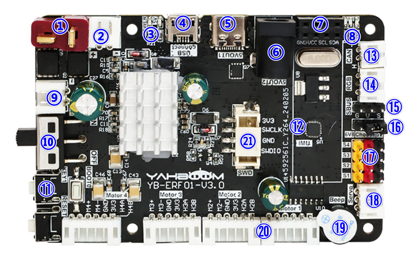
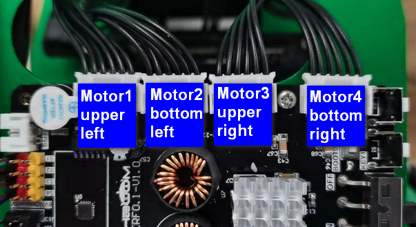
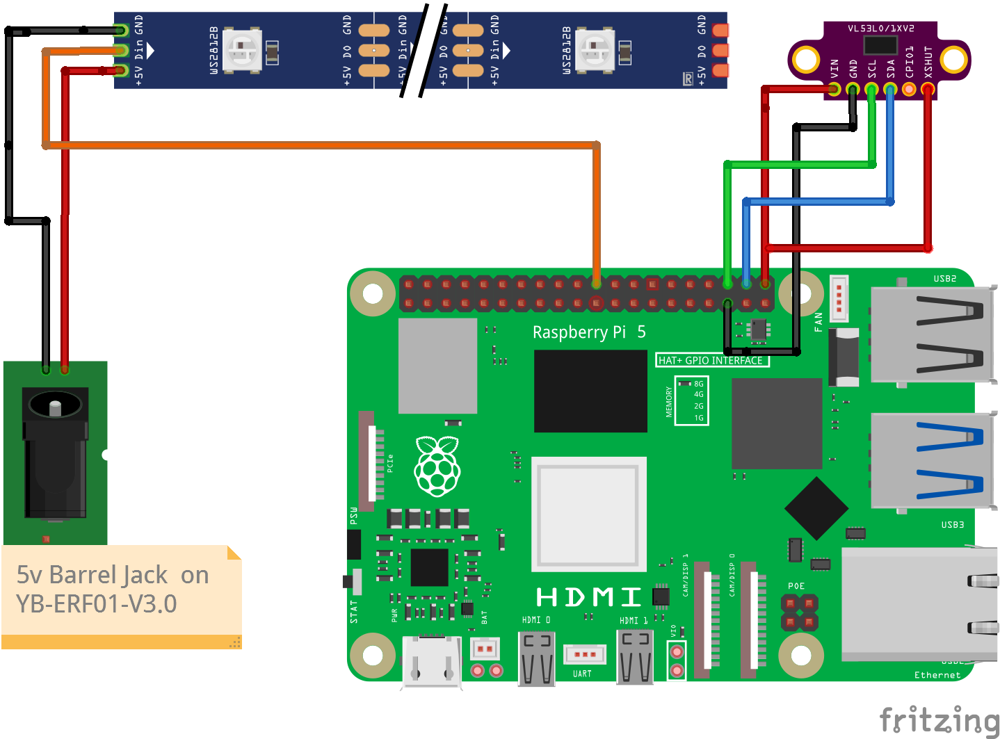
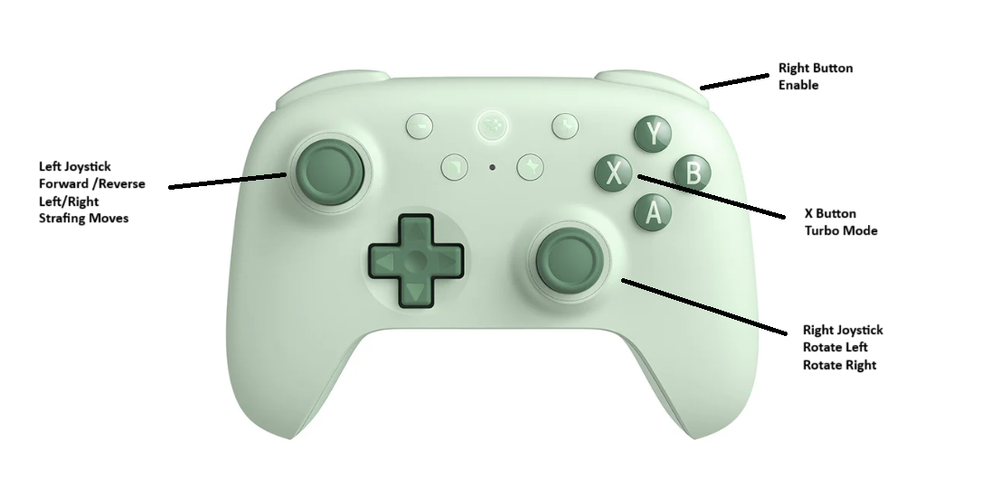

##  <a name='Mecca_WS-ROS2HumbleMecanumWheelsRobot'></a> Mecca_WS - ROS2 Humble Mecanum Wheels Robot <!-- omit in toc -->

This is a **ROS2 Humble** project supporting a **Mecanum Wheels** robot.


<p align="center">Mecca the Robot - fully assembled!</p>

---
### **Table of Contents**
<!-- TOC -->
- [System Overview](#system-overview)
- [Chassis and Construction](#chassis-and-construction)
- [Wiring](#wiring)
- [Configuration Settings](#configuration-settings)
- [Software Notes](#software-notes)
- [How to Use](#how-to-use)
- [Future Enhancements](#future-enhancements)

---
## <a name='SystemOverview'></a>System Overview
- The **STM32 controller board** listens on the serial port for motor commands from the Raspberry Pi.
- The STM32 also uses a **PID algorithm** to maintain precise speeds for accurate navigation.
- The **Raspberry Pi** accepts joystick commands for movement but **filters user inputs** with safety overrides based on data from the VL53L1X range sensor for **obstacle avoidance**.

---
## <a name='HardwareComponents'></a>Hardware Components <!-- omit in toc -->

The hardware for the robot consists of:

| #  | Item                                              |
|----|--------------------------------------------------|
| 1  | HiWonder Vehicle Chassis with Mecanum wheels        |
| 1  | Yahboom YB-ERF01-V3.0 STM32 robot controller |
| 1  | Raspberry Pi 5 running Ubuntu 24.04 and ROS2 Humble |
| 1  | VL53L1X Range Sensor                             |
| 1  | WS2812 Strip RGB (7 LEDs)                        |
| 1  | 12V Volt Meter for battery status indication     |
| 1  | 11.1V 3S LiPo Battery                            |
| 4  | JGB37-520 12V 205RPM Motors with Encoders        |
| 1  | Double Pole Double Throw rocker switch           |
| 1  | Panel mount banana jack for bench power supply input |
| 1  | USB-A to Micro USB cable                         |
| 1  | USB-C to USB-C cable                             |

---
## <a name='ChassisandConstruction'></a>Chassis and Construction
- The **aluminum chassis and mecanum wheels** were obtained from HiWonder as part of this kit:
  - [Hiwonder Large Metal 4WD Vehicle Chassis](https://www.hiwonder.com/products/large-metal-4wd-vehicle-chassis-green)
- The motors were later replaced with **Yahboom JGB37-520 motors** for better integration with the STM32 board. 
  - [Yahboom JGB37-520 Motors](https://category.yahboom.net/products/md520)
- Additional **3D-printed components** were added to extend the chassis to look like a truck cab and provide mounting for additional components.

---
## <a name='Wiring'></a>Wiring

### <a name='YB-ERF01-V3-0-Controller-Wiring'></a>YB-ERF01-V3.0 Controller Wiring <!-- omit in toc -->



| Reference | Connection |
|-----------|------------------------------------------------|
| 1. | The Deans connector is connected to the center poles of the DPDT Rocker Switch. |
| 4. | The Micro USB connector is connected to one of the USB ports on the Raspberry Pi. |
| 5. | The USB-C connector on the controller board is connected to the USB-C power input jack on the Raspberry Pi 5. |
| 6. | The 5V barrel jack output is connected to the Vin and GND for the WS2812 RGB LED strip. |
| 10. | The power switch on the controller board is left in the ON position. |
| 20. | The four motor/encoders are connected via 6-conductor cables to the four motor jacks. The motors are connected as shown in the diagram below. |



---

---
###  <a name='VL53L1XTime-of-FlightToFSensorWiringI2C'></a> VL53L1X Time-of-Flight (ToF) Sensor Wiring (I2C) <!-- omit in toc -->
The **VL53L1X ToF sensor** communicates via **I2C** and is connected as follows:

| **VL53L1X Pin** | **Raspberry Pi 5 Pin** | **Function** |
|---------------|------------------|------------|
| **VCC** | Pin **1** (3.3V) or Pin **2/4** (5V) | Power Supply |
| **GND** | Pin **6** (GND) | Ground |
| **SDA** | Pin **3** (GPIO2 - I2C SDA) | I2C Data |
| **SCL** | Pin **5** (GPIO3 - I2C SCL) | I2C Clock |
| **XSHUT** *(optional)* | Any GPIO (e.g., GPIO17 - Pin 11) | Enable/Disable Sensor |
| **GPIO1 (Interrupt)** *(optional)* | Any GPIO (e.g., GPIO27 - Pin 13) | Interrupt Signal |

- **Power Selection:** The sensor supports **both 3.3V and 5V**. If using 3.3V logic, connect to **Pin 1** (3.3V).
- **XSHUT Pin:** If controlled via software, connect it to a GPIO. Otherwise, pull it **high** to enable the sensor.
- **GPIO1 Interrupt:** Used if interrupt-based sensor reading is needed.

---
###  <a name='WS28127-LightRGBLEDStripWiringSPI'></a> WS2812 7-Light RGB LED Strip Wiring (SPI)  <!-- omit in toc -->
The **WS2812 LED strip** is controlled via **SPI Bus 0**, using the following connections:

| **WS2812 Pin** | **Raspberry Pi 5 Pin** | **Function** |
|---------------|------------------|------------|
| **VCC** | Pin **2** or **4** (5V) | Power Supply |
| **GND** | Pin **6** (GND) | Ground |
| **DIN** (Data In) | Pin **19** (GPIO10 - SPI0 MOSI) | SPI Data Line |

- **Data Line Control:** The LED strip **receives data via SPI0 MOSI (GPIO10, Pin 19)** instead of a standard GPIO-PWM method.
- **Level Shifting:** Ensure the LED strip operates at **5V logic**, as the Raspberry Pi’s GPIO runs at **3.3V**.
- **Power Requirements:** Each LED can draw **~60mA** at full brightness. Ensure your power supply can handle the total current demand.
---

Here is a pictorial diagram of the wiring to the Raspberry Pi 5:



---


## <a name='ConfigurationSettings'></a>Configuration Settings
- **I2C/SPI Configuration:** If I2C or SPI is disabled, enable them via:
  ```bash
  sudo raspi-config
  ```
  - Navigate to Interface Options > I2C or SPI > Enable.

---
## <a name='SoftwareNotes'></a>Software Notes
- There is a companion github repository for the STM32 project that controls PID tuning and general motor control via the serial connection between the controller board and the Raspberry PI. This repository is available here: https://github.com/stvenmobile/Car_Motion.git
- These are the ROS2 Humble nodes included in the current project:

 <!-- omit in toc -->

<!-- Prevent ToC Generator from Including Table -->
<!-- Table Start -->
| Node Name              | Function                                               |
|------------------------|-------------------------------------------------------|
| Mecca_Driver_Node    | Publishes motor commands                              |
| Serial_Comm          | Handles serial communication between Raspberry Pi & STM32 |
| LED_Controller_Node  | Controls the LED strip with different patterns based on movement |
| VL53L1X_Sensor       | Publishes distance to objects in front of the robot  |
| Navigator_Node       | Overrides motor commands when an obstacle is detected |
<!-- Table End -->

---
## <a name='HowtoUse'></a>How to Use
1. **Power on the robot** and ensure the STM32 controller is connected to the Raspberry Pi.
2. **Run the ROS2 launch file** to start all necessary nodes:
   ```bash
   ros2 launch mecca_ws mecca_bringup.launch.py
   ```
3. Alternatively, start the launch file as a system service.
4. **Use a joystick** to control the robot, or allow it to navigate autonomously.
5. The LED strip will reflect motion state changes with different light effects.



---
## <a name='FutureEnhancements'></a>Future Enhancements
- **SLAM Navigation:** Implementing mapping and autonomous movement.
- **Voice Commands:** Exploring ESP32-based voice control for movement.
- **Camera Integration:** Adding real-time video streaming.

---
