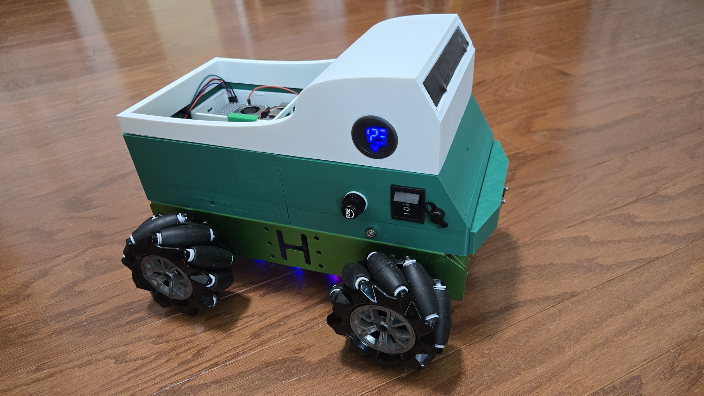

##  Mecca_WS - ROS2 Jazzy Mecanum Wheels Robot

This is a **ROS2 Jazzy** project supporting a **Mecanum Wheels** robot.



<p align="center">Mecca the Robot - fully assembled!</p>


## Hardware Components

The hardware for the robot consists of:

| #  | Item                                              |
|----|--------------------------------------------------|
| 1  | Yahboom YB-ERF01-V3.0 STM32 robot controller board |
| 1  | Raspberry Pi 5 running Ubuntu 24.04 and ROS2 Jazzy |
| 1  | VL53L1X Range Sensor                             |
| 1  | WS2812 Strip RGB (7 LEDs)                        |
| 1  | 12V Volt Meter for battery status indication     |
| 1  | 11.1V 3S LiPo Battery                            |
| 4  | JGB37-520 12V 205RPM Motors with Encoders       |

## System Overview

- The **STM32 controller board** listens on the serial port for motor commands from the Raspberry Pi.
- The STM32 also uses a **PID algorithm** to maintain precise speeds for accurate navigation.
- The **Raspberry Pi** accepts joystick commands for movement but **filters user inputs** with safety overrides based on data from the VL53L1X range sensor for **obstacle avoidance**.

## Chassis and Customizations

- The **aluminum chassis and mecanum wheels** were obtained from HiWonder as part of this kit:
  - *Hiwonder Large Metal 4WD Vehicle Chassis for Arduino/Raspberry Pi/ROS Robot with 12V Encoder Geared Motor*
- The motors were later replaced with **Yahboom JGB37-520 motors** for better integration with the STM32 board.
- Additional **3D-printed components** were added to extend the chassis and simplify electronics mounting.

## ROS Nodes

| Node Name              | Function                                               |
|------------------------|-------------------------------------------------------|
| `Mecca_Driver_Node`    | Publishes motor commands                              |
| `Serial_Comm`          | Handles serial communication between Raspberry Pi & STM32 |
| `LED_Controller_Node`  | Controls the LED strip with different patterns based on movement |
| `VL53L1X_Sensor`       | Publishes distance to objects in front of the robot  |
| `Navigator_Node`       | Overrides motor commands when an obstacle is detected |

---

# Mecca Robot Wiring Documentation

## 1. VL53L1X Time-of-Flight (ToF) Sensor Wiring (I2C)
The **VL53L1X ToF sensor** communicates via **I2C** and is connected as follows:

| **VL53L1X Pin** | **Raspberry Pi 5 Pin** | **Function** |
|---------------|------------------|------------|
| **VCC** | Pin **1** (3.3V) or Pin **2/4** (5V) | Power Supply |
| **GND** | Pin **6** (GND) | Ground |
| **SDA** | Pin **3** (GPIO2 - I2C SDA) | I2C Data |
| **SCL** | Pin **5** (GPIO3 - I2C SCL) | I2C Clock |
| **XSHUT** *(optional)* | Any GPIO (e.g., GPIO17 - Pin 11) | Enable/Disable Sensor |
| **GPIO1 (Interrupt)** *(optional)* | Any GPIO (e.g., GPIO27 - Pin 13) | Interrupt Signal |

- **Power Selection:** The sensor supports **both 3.3V and 5V**. If using 3.3V logic, connect to **Pin 1** (3.3V).
- **XSHUT Pin:** If controlled via software, connect it to a GPIO. Otherwise, pull it **high** to enable the sensor.
- **GPIO1 Interrupt:** Used if interrupt-based sensor reading is needed.

---

## 2. WS2812 7-Light RGB LED Strip Wiring (SPI)
The **WS2812 LED strip** is controlled via **SPI Bus 0**, using the following connections:

| **WS2812 Pin** | **Raspberry Pi 5 Pin** | **Function** |
|---------------|------------------|------------|
| **VCC** | Pin **2** or **4** (5V) | Power Supply |
| **GND** | Pin **6** (GND) | Ground |
| **DIN** (Data In) | Pin **19** (GPIO10 - SPI0 MOSI) | SPI Data Line |

- **Data Line Control:** The LED strip **receives data via SPI0 MOSI (GPIO10, Pin 19)** instead of a standard GPIO-PWM method.
- **Level Shifting:** Ensure the LED strip operates at **5V logic**, as the Raspberry Pi’s GPIO runs at **3.3V**.
- **Power Requirements:** Each LED can draw **~60mA** at full brightness. Ensure your power supply can handle the total current demand.

---

## Additional Notes
- **I2C Configuration:** If I2C is disabled, enable it via:
  ```bash
  sudo raspi-config


---

## Future Enhancements

- **SLAM Navigation:** Implementing mapping and autonomous movement.
- **Voice Commands:** Exploring ESP32-based voice control for movement.
- **Camera Integration:** Adding real-time video streaming.

---

### How to Use

1. **Power on the robot** and ensure the STM32 controller is connected to the Raspberry Pi.
2. **Run the ROS2 launch file** to start all necessary nodes:
   ```bash
   ros2 launch mecca_ws mecca_bringup.launch.py
3. **Use a joystick** to control the robot, or allow it to navigate autonomously.
4. The LED strip will reflect motion state changes with different light effects.


